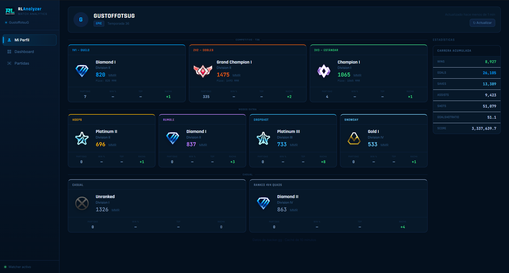

# RLAnalyzer

Aplicación de escritorio para analizar en profundidad tus partidas de Rocket League. Procesa automáticamente tus archivos `.replay`, los almacena en una base de datos local y los presenta en un dashboard visual con estadísticas detalladas, historial de MMR, datos de perfil de tracker.gg y un **visor 3D interactivo** de replays.



---

## Características

- **Procesado automático de replays** — detecta nuevos `.replay` y los analiza sin intervención
- **Dashboard** — resumen de victorias, derrotas, win rate y últimas partidas
- **Lista de partidas** — paginada, con filtros por resultado/modo/favoritas y detalle de cada partida
- **Vista detallada** — equipos, jugadores, estadísticas de boost y movimiento, comparativa vs tu media histórica
- **Visor 3D** — reproduce el replay frame a frame con campo bicolor, coches 3D con etiquetas, efectos de gol y timeline con marcadores clicables
- **Perfil** — rangos por modo (1v1, 2v2, 3v3, extras, casual), historial de MMR y estadísticas de carrera
- **Offline-first** — sirve los últimos datos conocidos cuando no hay conexión
- **App de escritorio** — ventana nativa de Windows sin necesidad de abrir el navegador

---

## Requisitos

| Herramienta | Versión mínima | Descarga |
|-------------|----------------|----------|
| Python | 3.10+ | https://python.org |
| Node.js | 18+ | https://nodejs.org |
| Rust (cargo) | estable | https://rustup.rs |

> Rust solo es necesario para compilar `subtr-actor-py` la primera vez. Si ya está instalado en tu sistema, el setup lo detecta automáticamente.
>
> `setup.bat` instala también **Playwright + Chromium** (~130 MB) para el perfil tracker.gg. Si la descarga falla, el resto de la app funciona con normalidad.

---

## Instalación

### 1. Clona el repositorio

```bash
git clone https://github.com/TU_USUARIO/RLAnalyzer.git
cd RLAnalyzer
```

### 2. Configura tus datos

Edita `backend/config.py`:

```python
PLAYER_NAME    = "TuNombreEnRocketLeague"   # nombre exacto en el juego
REPLAYS_FOLDER = r"C:\Users\TU_USUARIO\Documents\My Games\Rocket League\TAGame\DemosEpic"
```

### 3. Ejecuta el setup

```bat
setup.bat
```

Esto instala automáticamente:
- Dependencias Python (FastAPI, SQLAlchemy, etc.)
- `subtr-actor-py` compilado desde fuente (puede tardar 5-10 min la primera vez)
- **Playwright + Chromium** para el perfil tracker.gg (puede tardar 1-2 min)
- Dependencias npm del frontend
- Electron (wrapper de escritorio)
- Crea un acceso directo en tu escritorio

---

## Uso

**Abrir la app** — doble clic en el icono `RLAnalyzer` del escritorio, o ejecuta:

```bat
start-app.bat        # con ventana de consola (modo desarrollo/debug)
launch.vbs           # sin consola (modo normal)
```

La app arranca el backend y el frontend automáticamente y los cierra al cerrar la ventana.

**Primera vez sin replays** — si aún no tienes partidas procesadas, coloca algunos `.replay` en tu carpeta de Rocket League y la app los detectará y procesará en segundo plano.

---

## Perfil y tracker.gg

El perfil muestra rangos, MMR e historial desde [tracker.gg](https://rocketleague.tracker.network).

La app intenta obtener los datos en este orden:

1. **API tracker.gg** — si tienes API key y está aprobada
2. **Scraping HTTP** — intento rápido sin navegador
3. **Playwright headless** — Chromium real que carga la página completa (~15s, instala automáticamente con `setup.bat`)
4. **Caché en disco** — último dato guardado, funciona sin conexión

**API key (opcional):** cuando tracker.gg apruebe tu key de [tracker.gg/developers](https://tracker.gg/developers):
```
# backend/.env
TRACKER_API_KEY=tu-api-key-aqui
```

> Sin API key aprobada la app usa Playwright como fallback automático. Los datos se cachean en disco para uso offline.

> **Nota:** Las API keys de tracker.gg requieren aprobación manual. Contacta con ellos en su Discord si la key devuelve 403.

---

## Estructura del proyecto

```
RLAnalyzer/
├── backend/                 # API REST — Python + FastAPI
│   ├── config.py            # ← EDITA ESTO con tus datos (nombre, carpeta replays)
│   ├── .env                 # ← API keys (no se sube a git)
│   ├── main.py              # Punto de entrada del servidor
│   ├── parser.py            # Parseo de .replay con subtr-actor
│   ├── watcher.py           # Vigilancia automática de la carpeta
│   ├── replay_frames.py     # Extracción frame a frame con rrrocket (para el visor 3D)
│   ├── models.py            # Modelos SQLAlchemy
│   ├── database.py          # Conexión a SQLite
│   └── routers/
│       ├── replays.py       # Endpoints de partidas + frames
│       └── profile.py       # Endpoints de perfil + caché tracker.gg
├── frontend/                # UI — React + Vite + Tailwind
│   ├── src/
│   │   ├── pages/           # Dashboard, ReplayList, ReplayDetail, ReplayViewer, Profile
│   │   ├── components/      # Sidebar, StatCard, TitleBar
│   │   └── api.js           # Cliente HTTP con caché en memoria
│   └── public/
│       └── ranks/           # Iconos PNG de rangos (offline)
├── electron/                # Wrapper de escritorio
│   ├── main.js              # Gestiona ventana + procesos hijo
│   ├── preload.js           # Puente seguro IPC (contextIsolation)
│   └── icon.ico             # Icono de la app
├── data/                    # Generado automáticamente
│   ├── rl_data.db           # Base de datos SQLite
│   ├── profile_cache.json   # Caché de perfil tracker.gg
│   └── frames/              # Caché de frames 3D por replay (JSON compacto)
├── docs/                    # Documentación
├── tools/
│   └── rrrocket.exe         # Parser de network frames para el visor 3D
├── setup.bat                # Instalación inicial (ejecutar una vez)
├── start-app.bat            # Arranque con consola (debug)
├── launch.vbs               # Arranque sin consola (uso normal)
└── create-shortcut.bat      # Crea acceso directo en escritorio
```

---

## Stack tecnológico

| Capa | Tecnología |
|------|-----------|
| Backend | Python 3 + FastAPI + Uvicorn |
| Base de datos | SQLite + SQLAlchemy |
| Parser de replays | subtr-actor-py (Rust → Python) |
| Parser de frames | rrrocket.exe (network frames) |
| Frontend | React 18 + Vite + Tailwind CSS |
| Visor 3D | Three.js + OrbitControls |
| Gráficos | Recharts |
| Desktop | Electron (frameless, custom titlebar) |
| Perfil | tracker.gg API / web scraping / caché offline |

---

## Visor 3D

Desde el detalle de cualquier partida, pulsa **"Ver en 3D"** para abrir el visor interactivo.

- **Primera vez**: puede tardar 15-30 segundos mientras `rrrocket.exe` procesa los network frames. Las siguientes veces usa caché en disco (`data/frames/<id>.json`).
- **Controles de cámara**: arrastra para rotar, rueda para zoom, click derecho para desplazar.
- **Timeline**: haz clic en los marcadores de gol (líneas de color) para saltar al momento del gol.
- **Velocidad**: botones 0.5×, 1×, 2×, 4× en la esquina superior derecha.

> Los frames se cachean en `data/frames/`. Para forzar la re-extracción, borra el archivo `.json` correspondiente.

---

## Desarrollo

```bash
# Backend (puerto 8000)
cd backend && python main.py

# Frontend (puerto 5173)
cd frontend && npm run dev

# Abre http://localhost:5173 en el navegador
```

---

## Licencia

Uso personal. Sin licencia definida.
